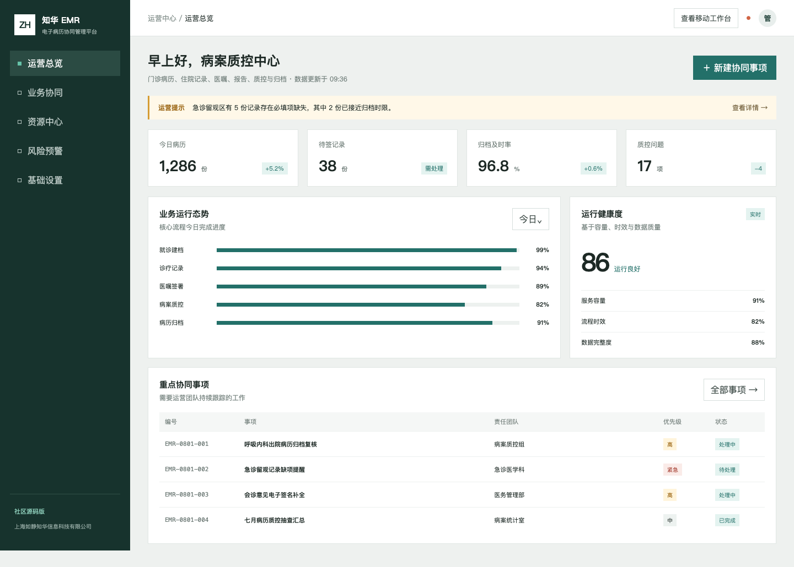
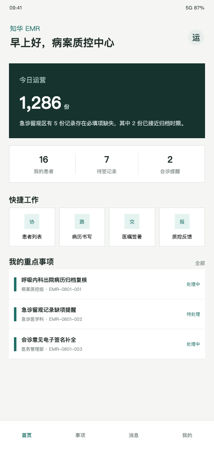

<div align="center">

# 知华 EMR 社区源码版

**面向病历协同与病案质控学习的 Java / Vue 前后端分离工程**

[知华科技官网](https://www.zhuatech.cn/) · [系统视图](#系统视图) · [能力清单](#能力清单) · [启动方式](#启动方式) · [授权说明](#授权说明)

</div>

> 本项目为软件技术演示，不处理真实患者数据，不构成医疗建议、诊断依据或正式病案质控结论。

## 系统视图



管理端以病历量、待签记录、归档及时率与质控缺陷为核心，集中跟踪科室整改和归档事项。



移动端展示患者工作、待签记录、会诊提醒和质控反馈入口，强调临床信息密度和移动适配。

## 能力清单

1. 病历运营：门诊、住院、医嘱、检验检查与归档事项的演示总览。
2. 病案质控：必填字段、电子签名、诊断缺项、报告回传和归档时限检查。
3. 权限基线：ADMIN 与 OPERATOR 角色隔离、接口鉴权和参数校验。
4. 多端页面：专业管理端与响应式 H5 工作台。
5. 工程能力：Java 21、Spring Boot 4、Vue 3、MySQL、Docker Compose 与集成测试。

病历完整性接口：`POST /api/admin/record-completeness`，返回完整度、`COMPLETE / REVIEW / BLOCK_ARCHIVE` 状态和缺陷清单。

## 启动方式

```bash
cp .env.example .env
docker compose up --build
```

- Web：`http://localhost:8090`
- 管理员：`admin / admin123`
- 操作员：`operator / operator123`

演示账户只能在本地学习环境使用，生产化必须更换凭据并增加医疗数据安全、审计、电子签名和合规措施。技术细节见 [接口文档](docs/API.md) 与 [架构文档](docs/ARCHITECTURE.md)。

## 授权说明

版权所有 © 2026 上海如静知华信息科技有限公司。

本工程仅限个人非商业学习、研究与交流；未经我方书面授权，不得商用，不得用于医院或其他机构的生产业务，不得提供 SaaS、收费下载、实施交付、外包服务、投标或二次销售。项目采用 ZhuaTech Community Source License 1.0（个人非商业版），不是 OSI 认可的开源许可证，完整条款见 [LICENSE](LICENSE)。

## 联系知华科技

商业授权、医疗信息化适配、私有化部署和深度开发定制，请访问 [https://www.zhuatech.cn/](https://www.zhuatech.cn/) 或扫描微信二维码。

<p align="center">
  
  &nbsp;&nbsp;&nbsp;
  
</p>

关键词：知华科技 EMR、电子病历系统、病案管理、病历质控、医疗信息化、Java EMR、Spring Boot 医疗系统、上海软件定制。

## 用药安全门禁

新增 `POST /api/emr/insights/medication-safety`，综合过敏匹配、药物相互作用、重复治疗、肾功能剂量调整和入院用药核对，返回 `CLEAR`、`REVIEW` 或 `BLOCK` 及可解释风险提示。
